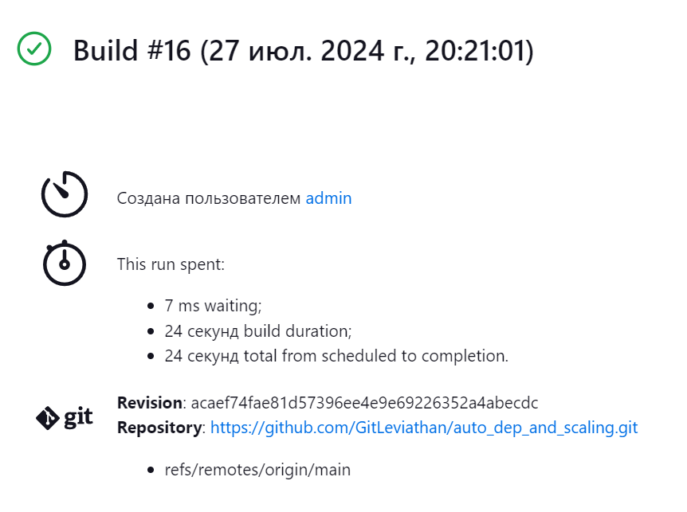

# ТЗ
:octocat:  
Создать систему для автоматизированного развертывания и масштабирования веб-приложения с CI/CD пайплайном, используя Jenkins, Docker и Kubernetes.

### Шаги реализации
1. [Создание простого веб-приложение на Python с использованием Flask](#title1)
2. [Контейнеризация приложения](#title2)
3. [Настройка Jenkins](#title3)
   * Установка и настройка Jenkins
   * Установка необходимых плагинов для работы с Docker и Kubernetes
   * Создание Jenkins Pipeline для автоматизации процессов сборки, тестирования и развертывания Docker-образов
4. [Оркестрация с Kubernetes](#title4)
   * Настройка Kubernetes кластер
   * Создание манифеста Kubernetes для развертывания веб-приложения
   * Настройка Jenkins для деплоя приложения в Kubernetes кластер

Рассмотрим вариант установки на WSL Ubuntu 22.04.

## Подготовка

Если WSL не установлен, пользуемся официальным сайтом microsoft:
https://learn.microsoft.com/ru-ru/windows/wsl/install-manual#step-4---download-the-linux-kernel-update-package

Сначала обновляем список пакетов и список установленных пакетов, затем устанавливаем Python, pip и flask:
``` bash 
sudo apt update
sudo apt upgrade
sudo apt install python3
sudo apt install python3-pip
pip install Flask
```

Нам понадобится Docker, его можно установить с официального сайта, на котором есть инструкция https://docs.docker.com/engine/install/ubuntu/.

Для дальнейшей удобной установки Kubernetes нам понадобится Minikube. Подробная установка minikube есть на их официальном сайте https://www.linuxbuzz.com/install-minikube-on-ubuntu/.

## <a id="title1">1. Создание веб-приложения</a>

Создадим простой проект следующей структуры:

```
auto_dep_and_scaling/ 
│ 
├── app.py 
└── requirements.txt
```

Файл app.py содержайщий основной код нашего веб-приложения. Допустим что-то простое, на пример, любимый всеми "Hello world!".

Файл requirements.txt содержащий список зависимостей, необходимых для запуска нашего приложения и используется для автоматической установки зависимостей с помощью команды:

> pip install -r requirements.txt

Нам для корректной работы понадобятся следующие зависимости:  
Flask - веб-фреймворк для Python  
Werkzeug - библиотека WSGI для Python, предоставляющая инструменты для создания веб-приложений и их серверной логики  
Pytest - фреймворк для тестирования на Python

## <a id="title2">2. Контейнеризация приложения</a>

Обновляем пакеты и устанавливаем необходимые зависимости:
> sudo apt-get install -y apt-transport-https ca-certificates curl software-properties-common

Добавляем официальный GPG-ключ Docker:
> curl -fsSL https://download.docker.com/linux/ubuntu/gpg | sudo apt-key add -

Добавляем репозиторий Docker в список источников APT:
``` bash
sudo add-apt-repository 
  "deb [arch=amd64] https://download.docker.com/linux/ubuntu 
  $(lsb_release -cs) 
  stable"
```

Обновляем список пакетов и устанавливаем Docker:
> sudo apt-get install -y docker-ce

Создаём Dockerfile:  
- FROM python:3.10.12: Базовый образ с установленным Python 3.10.12. Можно использовать версию slim, чтобы уменьшить размер образа.  
- WORKDIR /app: Устанавливаем рабочую директорию внутри контейнера.  
- COPY requirements.txt .: Копируем файл requirements.txt в рабочую директорию контейнера.
- RUN pip install --no-cache-dir -r requirements.txt: Устанавливаем зависимости из файла requirements.txt.  
- COPY . .: Копируем все файлы и директории из текущей директории на хосте в рабочую директорию контейнера.  
- EXPOSE 5000: Инструктируем Docker, что контейнер слушает на порту 5000.
- CMD ["python", "app.py"]: Определяем команду для запуска приложения при запуске контейнера.

Собираем Docker-образ:
> docker build -t auto_dep_and_scaling .

## <a id="title3">3. Настройка Jenkins</a>

Сначала устанавливаем Java Development Kit (JDK), который необходим для работы Jenkins:
> sudo apt install openjdk-17-jdk -y

Добавляем ключ и репозиторий Jenkins:

``` bash
curl -fsSL https://pkg.jenkins.io/debian/jenkins.io-2023.key | sudo tee /usr/share/keyrings/jenkins-keyring.asc > /dev/null

echo deb [signed-by=/usr/share/keyrings/jenkins-keyring.asc] 
  https://pkg.jenkins.io/debian binary/ | sudo tee 
  /etc/apt/sources.list.d/jenkins.list > /dev/null
```

Устанавливаем Jenkins:

> sudo apt update  
sudo apt install jenkins -y

Запускаем Jenkins:
> sudo jenkins

При первом запуске Jenkins выдаёт пароль для дальнейшего входа через admin и подсказывает, в каком файле его потом можно найти. Запускаем Jenkins через http://localhost:8080 и следуем инструкции по установке.

Переходим в "Настройки Jenkins" > "Plugins" и устанавливаем следующие плагины:
- Docker Plugin
- Kubernetes Plugin
- Pipeline: REST API Plugin


Создадим Jenkins Pipeline для автоматизации процессов сборки, тестирования и развертывания Docker-образов.

Переходим в "Создать Item" и создаём новый Pipeline.
Вводим имя проекта и выбираем Pipeline.

Настройка SCM (Source Code Management)
В разделе Pipeline, выбираем Pipeline script from SCM и настраиваем ваш Git репозиторий:

Создаём новый Credentials, если он ещё не создан:
- Kid: Username with password
- Scope: Global/System в зависимости от того, что необходимо
- Username/Password: Указываем учетные данные для доступа к репозиторию
- ID: Можно оставить пустым, это внутренний уникальный идентификатор, по которому эти учетные данные идентифицируются из заданий и другой конфигурации. Подробности есть во внутренней подсказке Jenkins

- SCM: Git
- Repository URL: URL вашего репозитория
- Credentials: Указываем учетные данные для доступа к репозиторию  
- Branches to build: Проверяем, что совпадает с названием ветки нашего репозитория

Создаём Jenkinsfile в корневой директории нашего проекта. Этот файл содержит сценарий для Pipeline, который будет использовать Jenkins.

``` 
auto_dep_and_scaling/ 
│ 
├── app.py 
├── requirements.txt 
├── Dockerfile 
└── Jenkinsfile
```

Объяснение Pipeline:

- pipeline: Определяет блок Pipeline.
- agent any: Указывает, что Pipeline может выполняться на любом доступном агенте.
- environment: Определяет переменные среды, такие как REPO и KUBECONFIG_CREDENTIALS_ID.
- stages: Содержит несколько стадий, таких как Build, Test, Push и Deploy.
  - Build: Собирает Docker-образ приложения.
  - Test: Запускает тесты внутри контейнера.
  - Push: Отправляет Docker-образ в Docker Hub.
  - Deploy: Применяет Kubernetes манифесты для развертывания приложения.

Так как мы планируем проводить тесты, создаём директорию tests. В ней будут два файла:
- __init__.py файл может быть пустым, но он необходим для того, чтобы Python рассматривал директорию tests как пакет
- test_app.py в котором будут содержаться наши тесты

Теперь проект должен иметь вид:

``` 
auto_dep_and_scaling/ 
│ 
├── app.py 
├── requirements.txt 
├── Dockerfile 
├── Jenkinsfile 
└── tests/ 
    ├── __init__.py 
    └── test_app.py
```

## <a id="title4">4. Оркестрация с Kubernetes</a>

Создаём директорию для k8s с двумя файлами:

Создаём `deployment.yaml`:
- replicas: Определяет количество реплик (экземпляров) приложения, которые будут работать одновременно.
- selector: Определяет, какие Pods будут управляться этим Deployment.
- template: Определяет шаблон для создания Pods, включая контейнер и его конфигурацию.

Создаём `service.yaml`:
- selector: Определяет, какие Pods будут обслуживаться этим Service.
- ports: Определяет порты, на которых Service будет доступен (порт 80 для внешнего трафика, перенаправляемый на порт 5000 контейнера).
- type: LoadBalancer: Создает внешний балансировщик нагрузки (это может потребовать дополнительных настроек, если вы не используем облачный провайдер).

После этого директория должна выглядеть следующим образом:
```
auto_dep_and_scaling/ 
│ 
├── app.py 
├── requirements.txt 
├── Dockerfile 
├── Jenkinsfile 
├── tests/ 
│   ├── __init__.py 
│   └── test_app.py 
└── k8s/ 
    ├── deployment.yaml 
    └── service.yaml
```

Заходим в "Настроить Jenkins" > "Credentials".  
Переходим в "Manage Jenkins".  
В Manage Credentials выбираем область (например, global или system), где вы хотите добавить Credentials.  
В поле Kind выбираем Secret file.  
В поле ID вводим kubeconfig. Это идентификатор, который мы будем использовать в Jenkinsfile для ссылки на эти credentials.  
В поле File нажимаем кнопку Choose File и выбираем файл kubeconfig/config. По умолчанию он лежит в ~/.kube/config. Если в дальнейшем снова делать чистый запуск, то нужно будет обновлять config файл.

Теперь настроим Jenkins для развертывания приложения в Kubernetes кластер. Добавляем Kubernetes Credentials в Jenkins.

Переходим в Manage Jenkins > Manage Credentials. Добавляем новый Kubeconfig credentials:
- Kind: Kubernetes Config
- ID: kubeconfig
- File: выбираем файл kubeconfig (файл конфигурации Kubernetes, который мы можем получить после создания кластера).

Объяснение шагов в Deploy стадии:
- withCredentials: Загружает файл конфигурации Kubernetes из Jenkins.
- sh 'kubectl apply -f k8s/deployment.yaml': Применяет манифест Deployment для развертывания приложения.
- sh 'kubectl apply -f k8s/service.yaml': Применяет манифест Service для обеспечения доступа к приложению.


